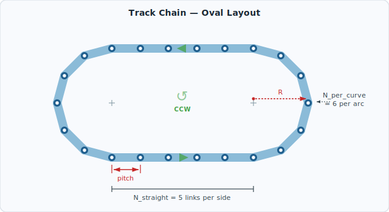
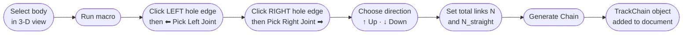
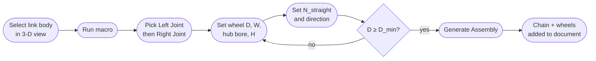
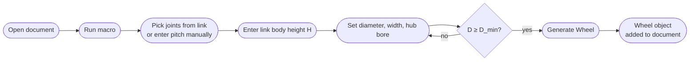

# FreeCAD Tools

A collection of FreeCAD macros for mechanical design automation.

---

## Macros

### TrackChain — Track Link Chain Generator

Generates a complete track-link chain (tank / conveyor style) as a FreeCAD Part compound.  
The chain is laid out as an oval with two straight runs and two semicircular ends.

---

### Chain layout



> **R** = arc radius · **pitch** = joint-to-joint distance · arrows show CCW direction

---

### Features

| | |
|---|---|
| Interactive joint picker | Click hole edges in the 3-D view — no manual coordinate entry |
| Live pitch readout | Displays joint-to-joint distance as soon as both joints are picked |
| Loop direction | Up (CCW) or Down (CW) — switch when the chain wraps the wrong way |
| Oval or circular | Set straight-section count to `0` for a pure circle |
| Exact joint alignment | Chord-based arc radius ensures every pin hole meets its neighbour precisely |

---

### Requirements

| Dependency | Version |
|---|---|
| FreeCAD | 0.20 or later |
| PySide2 | bundled with FreeCAD |

---

### Installation

Copy `macros/TrackChain.FCMacro` into your FreeCAD macros folder:

| Platform | Path |
|---|---|
| Linux | `~/.local/share/FreeCAD/Macro/` |
| macOS | `~/Library/Application Support/FreeCAD/Macro/` |
| Windows | `%APPDATA%\FreeCAD\Macro\` |

Then open it via **Macro → Macros…** in FreeCAD.

---

### Usage workflow



The dialog is **non-modal** — the 3-D view stays fully interactive while it is open.

---

### Parameters

| Parameter | Range | Notes |
|---|---|---|
| Total links | 4 – 9998 (even) | Odd values are rounded down automatically |
| Links per straight side | 0 – N/2−2 | `0` = pure circle, higher = longer oval |
| Loop direction | Up / Down | **Up (CCW)** — curves above the straights; **Down (CW)** — curves below |

---

### Geometry

The oval consists of four sections:

```
         ← N_straight links →
    ●────────────────────────●   ← top straight
   ╱                          ╲
  ╱   N_per_curve links each   ╲  ← arcs
  ╲                            ╱
   ╲                          ╱
    ●────────────────────────●   ← bottom straight
```

| Symbol | Formula | Description |
|---|---|---|
| `pitch` | `\|j2 − j1\|` | Distance between the two picked joint centres |
| `R` | `pitch / (2 · sin(π / (2 · N_per_curve)))` | Arc radius — circumradius of the inscribed polygon with side = pitch |
| `straight length` | `N_straight · pitch` | Length of each straight run |

Using the chord-based radius ensures the pin-to-pin chord on the arc equals exactly one `pitch`, so every joint hole coincides perfectly with its neighbour.

The direction multiplier `D = ±1` mirrors the entire layout in Y — no geometry is recomputed, the whole chain flips.

---

### Output

A `Part::Feature` named `TrackChain_<N>links_<up|down>` is added to the active document as a compound of `N` transformed copies of the source link's `Shape`.

---

### TrackAssembly — Complete Track Assembly Generator

Generates the full track assembly in one shot: chain compound + one or both drive wheels.  
This is the **recommended macro** — it replaces running TrackChain and Wheel separately.

#### Features

| | |
|---|---|
| Single workflow | Pick joints once, set wheel diameter, get chain + wheels together |
| Wheel placement | Wheels are positioned exactly at the arc centers — chain rides flush on the rims |
| Select what to generate | Independent checkboxes for chain, left wheel, right wheel |
| All validation included | Minimum diameter guard, bore < D check, N_per_arc computed live |

#### Parameters

| Parameter | Default | Notes |
|---|---|---|
| Wheel diameter D | 80 mm | Drives N_per_arc automatically |
| Wheel width W | 20 mm | Should be ≥ chain inner width |
| Hub bore ⌀ | 10 mm | Set to 0 for solid wheel |
| Link body height H | 8 mm | Drives minimum diameter check |
| Links per straight side | 8 | 0 = pure circle |
| Loop direction | Up (CCW) | Switch if chain wraps the wrong way |

#### Output

| Object | Name |
|---|---|
| Chain compound | `TrackChain_<N>links_<up\|down>` |
| Left wheel | `Wheel_Left_D<D>mm` |
| Right wheel | `Wheel_Right_D<D>mm` |

#### Usage workflow



---

### Wheel — Track Wheel Generator

Generates a smooth cylindrical wheel that a track chain wraps around.  
The chain links ride on the wheel's rim edge — no teeth or pockets needed.

#### Features

| | |
|---|---|
| Dual pitch mode | Pick joint holes from a chain link OR type pitch manually |
| Minimum diameter guard | Computes the smallest wheel that fits the link body geometry — Generate is disabled if the chosen diameter is too small |
| Live computed panel | N per arc, minimum wheel ⌀, and minimum straight section update instantly |
| Hub bore | Optional central axle hole |

#### Parameters

| Parameter | Default | Notes |
|---|---|---|
| Wheel diameter D | 80 mm | Outer diameter the chain rides on |
| Width W | 20 mm | Should be ≥ chain inner width |
| Hub bore ⌀ | 10 mm | Axle bore; set to 0 for a solid wheel |
| Link body height H | 8 mm | Height of the chain link body — drives the minimum diameter check |

#### Minimum wheel diameter

If the wheel is too small, the rigid link bodies collide with the rim as they transition from the arc to the straight section. The safe minimum is:

```
R_min = P² / H  +  H / 4
D_min = 2 × R_min
```

where `P` = pitch and `H` = link body height. The macro enforces this.

#### Usage workflow



#### Using with TrackChain

The **N per arc** value shown in the Computed panel is the exact number to enter in TrackChain's *"Links per straight side"* calculation:

1. Run Wheel macro → note **N per arc**
2. Run TrackChain → set **Total links** so that `(Total − 2 × N_straight) / 2 = N per arc`
3. The chain arcs will match the wheel diameter exactly

#### Output

`Part::Feature` named `Wheel_D<D>mm_<pitch>mm_pitch` added to the active document.

---

## License

MIT
